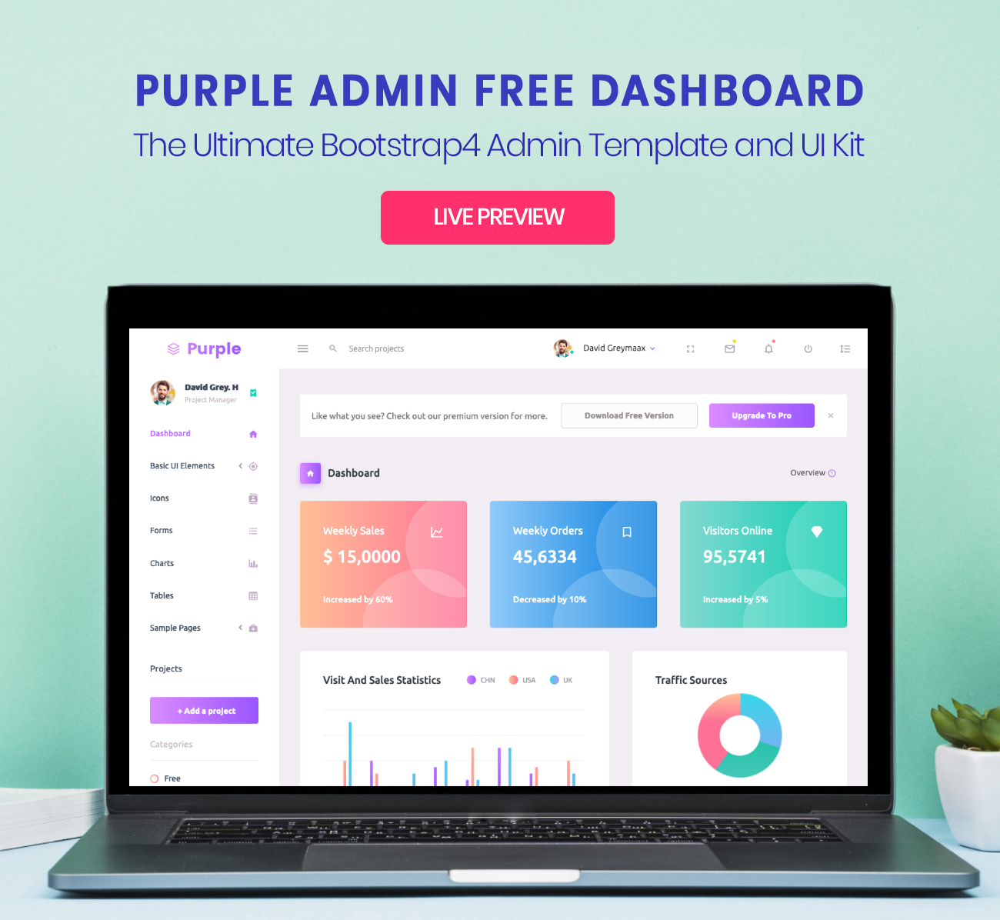

<h1>PurpleAdmin-Django-Admin-Template</h1>
Purple Admin is a free responsive admin template built with Bootstrap 4. The template has colorful, attractive yet simple and elegant design. The template is well crafted, with all the components neatly and carefully designed and arranged within the template.

Purple Admin is packed with all the features that fit your needs but not cramped with components you would not even use. It is an excellent fit to build admin panels, e-commerce systems,  project management systems, CMS or CRM.

Although the template has a design like none other, it is easily customizable to suit your requirements. Purple Admin comes with a clean and well-commented code that makes it easy to work with the template. Thus making it an ideal pick for jump starting your project.

<h1>Credits:</h1>

- Bootstrap 4
- Material Design Icons
- jQuery

<h1>Browser Support:</h1>

Purple Admin is designed to work flawlessly with all the latest and modern web browsers.

- Chrome (latest)
- FireFox (latest)
- Safari (latest)
- Opera (latest)
- IE10+  

<h1>License Information:</h1>

Purple Admin is released under MIT license. Feel free to download it, use it, share it, get creative with it.

<h1>How to Contribute?:</h1>

We love your contributions and we welcome them wholeheartedly. We believe the more the merrier.
To contribute make sure you have a Node.js and npm installed. Now run the command gulp --version. If the command returns with the Gulp version number, it means you have Gulp installed. If not you need to run the command npm install --global gulp-cli to install Gulp.

<h2>Next</h2>

After Gulp has been installed, follow the steps below to contribute.
   
	1 - Fork and clone the repo.
   
	2 - Make your valuable contribution
   
	3 - Submit a pull request.
  

